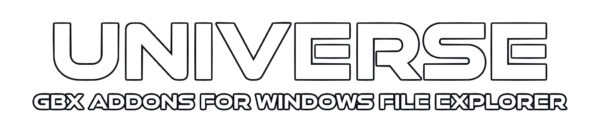

<div align="center">

[](https://github.com/BigBang1112/win-file-explorer-gbx-addons/releases) [](https://github.com/BigBang1112/win-file-explorer-gbx-addons/releases)

</div>

<p align="center">Happy to present a couple of addons to make Gbx file scrolling just a little more comfortable on Windows.</p>

<p align="center">Due to usage of COM, these addons are supported widely across alternative file browsers on Windows.</p>

## Thumbnail / Icon

**Package name: `WinFileExplorerGbxAddons.Thumbnail`**

1. Shows thumbnail on all `CGameCtnChallenge` files:
    - Challenge.Gbx
    - Map.Gbx
2. Shows icons on all `CGameCtnCollector` files:
    - Item.Gbx / Block.Gbx / ObjectInfo.Gbx
    - Macroblock.Gbx
    - Decoration.Gbx
    - (TM)ED___.Gbx

## Gbx Icon Overlay

**Package name: `WinFileExplorerGbxAddons.IconOverlay`**

Shows a small Gbx icon on top of the file thumbnail, making it easier to distinguish image file from Gbx file for example.

## Installation

**.NET 7 Runtime is required for these addons to work,** see below for the easiest ways to install it.

### Recommended (via WinGet)

> !!! All WinGet packages coming from the BigBang1112 GitHub account will be available **ONLY on https://winget.bigbang1112.cz** !!!

1. Install [WinGet](https://www.microsoft.com/p/app-installer/9nblggh4nns1) via Microsoft Store.
2. In your Start Menu, type `cmd`, and press Enter.
3. Type these commands below (individually):

```
winget install Microsoft.DotNet.Runtime.7
winget source add --name BigBang1112 https://winget.bigbang1112.cz -t Microsoft.Rest
winget install WinFileExplorerGbxAddons.Thumbnail
winget install WinFileExplorerGbxAddons.IconOverlay
```

4. Done.

In most cases, the changes should appear immediately.

In rare cases, you need to log in/out from Windows or restart it.

Each `WinFileExplorerGbxAddons` package is independent, you can only install those that you want.

> Many of my other projects will be coming soon to WinGet as well!

### Alternative (manually via .msi file download)

1. Install [.NET 7 Runtime (desktop apps)](https://dotnet.microsoft.com/en-us/download/dotnet/7.0/runtime)
2. Download the [latest .MSI release](https://github.com/BigBang1112/win-file-explorer-gbx-addons/releases) of the addons you want according to your OS
3. Run the .MSI and proceed.
4. Done.

## Build

You need .NET 7 SDK and Wix Toolset to build the solution fully.

In Visual Studio, you can simply install HeatWave extension, which will automatically prepare Wix for you.

To test the addon after building (which is a COM library), use `regsvr32.exe [addon].comhost.dll` to install the addon and `regsvr32.exe /u [addon].comhost.dll` to uninstall it.

## Special thanks

To people sharing their development problems on the internet, this was really hard to put together.

<h2 align="center">#20yearsoftrackmania</h2>
